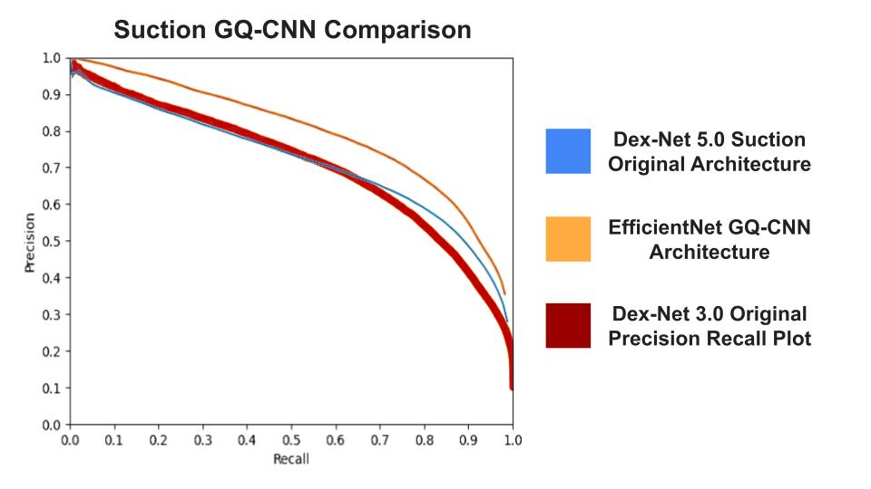
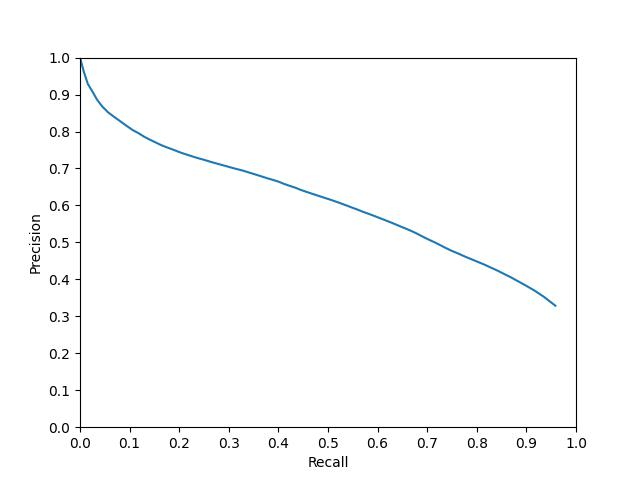
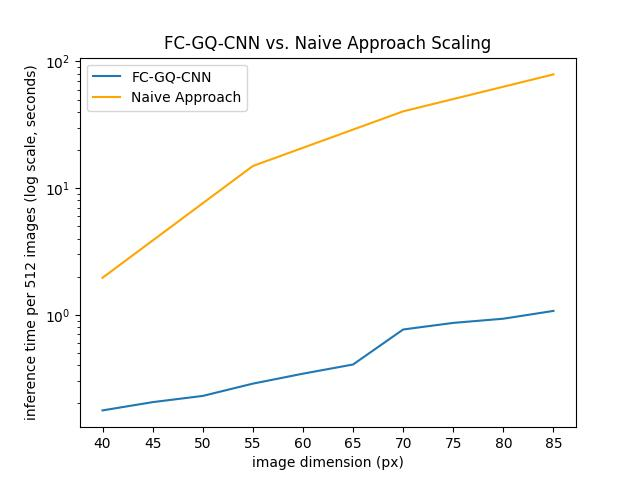

# Dex-Net 5.0 - A PyTorch implementation to train on the Dex-Net Dataset
Dex-Net 5.0 is a PyTorch implementation to train on the original Dex-Net 2.0 parallel jaw grasp and Dex-Net 3.0 suction grasp datasets. It provides improved performance and ease of use over the original codebase. Dex-Net grasp quality models take normalized single channel depth images as input and output grasp confidences. This repo implements a model similar to the original GQ-CNN (Grasp Quality Convolutional Neural Network) architecture along with a new EfficientNet-based GQ-CNN architecture. It also provides an FC-GQ-CNN (Fully Convolutional Grasp Quality Neural Network) architecture for grasp quality heatmap generation and training + analysis code for the models.

This project is created and maintained by [AUTOLab at UC Berkeley](https://autolab.berkeley.edu/)

## 📚 Original Work
Dex-Net 5.0 is an extension of previous work which can be found here:

📋 [Dex-Net Project Website](https://berkeleyautomation.github.io/dex-net/) $\~\~\~\~$ 📚 [Dex-Net Documentation](https://berkeleyautomation.github.io/dex-net/code.html)  $\~\~\~\~$ 📦 [Dex-Net Package GitHub](https://github.com/BerkeleyAutomation/dex-net)

## 🚧 Project Setup

View [PyTorch's Getting Started Page](https://pytorch.org/get-started/locally/) for PyTorch installation options

```
git clone https://github.com/BerkeleyAutomation/dexnew.git
cd Dex-Net-5.0
pip install -e .
```

The version of the Dex-Net 2.0 and 3.0 dataset used for training in this repository can be downloaded [here](https://drive.google.com/file/d/1sQakDHBZDr9tZECQH6xS0BnhzS5nNRJG/view?usp=sharing) 

The model weights for suction and parallel jaw grasping can be found [here](https://drive.google.com/drive/folders/1FKs4O_Ss6NIEOa5PqrsZL8kbmZ_JxkuB?usp=sharing)

Other published datasets and mesh files from previous works can be found [here](https://drive.google.com/drive/u/1/folders/1-6o1-AlZs-1WWLreMa1mbWnXoeIEi14t)


## 🛠️ Usage

### Getting Started Notebook (GettingStarted.ipynb)

A quickstart notebook to run GQ-CNN inference on the Dex-Net dataset and FC-GQ-CNN inference on an example depth image.

### train_model.py

Runs train-eval loop based on the given config.

```
python3 scripts/train_model.py --config PATH_TO_DESIRED_CONFIG_FILE
```

### grasp_model.py

Defines models. Models take in a batch of normalized single channel depth images and output grasp confidence(s) (see **Grasp Models** section for more details).

### torch_dataset.py

Provides PyTorch dataset to load the Dex-Net 3.0 and Dex-Net 2.0 datasets. The datasets contain cropped 32x32 depth images of single objects paired with a grasp confidence score. For Dex-Net 2.0 data, this grasp metric corresponds to a parallel jaw grasp centered at the middle of the image and with the grasp axis horizontally on the image. For Dex-Net 3.0, this score corresponds to a suction grasp at the center of the image with the approach axis aligned to the middle column. See [Dex-Net 2.0](https://arxiv.org/abs/1703.09312) and [Dex-Net 3.0](https://arxiv.org/abs/1709.06670) for more details on dataset generation.

### convert_weights.py

Convert GQ-CNN weights to FC-GQ-CNN weights. Saves converted model to   `outputs/{file_name}_conversion.pt`


```
python3 scripts/convert_weights.py --model_path PATH_TO_MODEL
```

This is only supported for DexNetBase weights.

### analyze.py

Contains functions to generate precision-recall curves and compute the mean and standard deviation over the dataset.

```
python3 scripts/analyze.py --model_path PATH_TO_MODEL --model_name [DexNetGQCNN, EfficientNet]
```

### time_benchmark.py

Script to benchmark the inference speed of models on random image-shaped data.

### Configs

The configs include YAML files specifying model name, save name, dataset path, optimizer, Wandb logging, batch size, and more. The dataset path should be to the directory containing the "tensors" folder for either the Dex-Net 2.0 or Dex-Net 3.0 dataset.

## 🧠 Grasp Models

**GQ-CNN**s (Grasp Quality Convolutional Neural Networks) are models that use a CNN backbone to predict grasp confidence scores. In Dex-Net 5.0 models labeled GQ-CNN take 32x32 images as input and output a single grasp confidence value associated with the center of the image.

**FC-GQ-CNN**s (Fully Convolutional Grasp Quality Neural Networks) are fully convolutional models. In Dex-Net 5.0 these can process image sizes larger than 32x32 and output a heatmap of grasp confidences in a single pass. A fully convolutional structure allows for faster inference over running multiple forward passes with a typical GQ-CNN. See **Performance Analysis** section for more details.

**DexNetBase** folllows the model described in [Dex-Net 2.0](https://arxiv.org/pdf/1703.09312.pdf). However, unlike the original implementation, it doesn't take the gripper z distance as input because this was not found to impact training (see **Performance Analysis** for more detail). It takes only a batch of 32x32 normalized depth images as input. 

**EfficientNet** uses PyTorch's efficientnet_b0 implementation with an additional linear layer and softmax. It slightly outperforms "DexNetGQCNN" on suction (see **Performance Analysis** section).

**BaseFCGQCNN** is a fully convolutional network that takes a batch of normalized depth images which may be larger than 32x32 and returns a grasp confidence heatmap. DexNet GQ-CNN weights can be converted to Dex-Net FC-GQ-CNN weights using convert_weights.py. This can be done for both suction and parallel jaw grasp models.

**HighResFCGQCNN** is a fully convolutional network that outputs higher-resolution grasp maps compared to BaseFCGQCNN. It uses an offsetting trick to prevent dimension reduction from the max-pool layer.

**fakeFCGQCNN** runs a provided GQ-CNN across each 32x32 crop of an image to return a grasp confidence heatmap. This model is inefficient and is intended for testing and benchmarking purposes.

## 🔍 Performance Analysis

### 🪠 Suction


*Training with the original architecture (Dex-Net Base) matches the performance documented in Dex-Net 3.0. EfficientNet GQ-CNN outperforms both models on the Dex-Net 3.0 dataset. Precision-recall curves are computed from a validation set containing separate objects from the train set.*

#### Dex-Net Base Suction
- 18 million parameters
- 10240 (batch size 512), 24100 (batch size 8192) inferences per second on a single 2080Ti
- 6 hours of training on a single 2080 Ti
- Trained with a batch size of 256
- Trained with SGD and 0.9 momentum
- FC-GQ-CNN version available

#### EfficientNet GQ-CNN
- 5.3 million parameters
- 2000 (batch size 512) inferences per second on a single 2080Ti
- 30 hours of training on a single 2080 Ti
- Trained with a batch size of 64
- Trained with Adam optimizer

Note that while EfficientNet is a smaller model, it scales input images to (B, 3, 224, 224) which prevents larger batch sizes.

### 🦈 Parallel Jaw

<p align="center">
  <br><br>
  <i>Precision-recall curve on validation data for the Dex-Net 5.0 parallel jaw grasp model (DexNetBase) trained on an 80-20 split of the Dex-Net 2.0 dataset. There isn't a comparable precision-recall curve from the original paper, but both achieve ~85% accuracy on the validation set.</i>
  <br><br>
</p>

**Dex-Net Base Parallel Jaw**
- 18 million parameters
- 10240 (batch size 512), 24100 (batch size 8192) inferences per second on a single 2080Ti
- 1 hour of training on a single V100
- Trained with a batch size of 256
- Trained with SGD and 0.9 momentum
- FC-GQ-CNN version available

Dex-Net Base Parallel Jaw and Dex-Net Base Suction use the same model architecture.

### 🕙 FC-GQ-CNN Inference Speed

<p align="center">
  <br><br>
  <i>The FC-GQ-CNN demonstrates significant empirical efficiency improvements over naively running a GQ-CNN over each crop of the image.</i>
  <br><br>
</p>

The naive method (called fakeFCGQCNN in code) achieves 13.5 inferences per second. FC-GQ-CNN achieves 540 inferences per second, a 22x speedup (batch size 128, 70x70 images).

Note that at larger batch sizes, FC-GQ-CNN may experience a significant slowdown due to memory limitations.

### 📐 Angle Analysis


*Models trained on the Dex-Net 3.0 dataset with or without the gripper approach angle and gripper z distance as inputs show no clear change from our baseline (dex3_newaug) which receives both as input.*

## 📝 Citation
Please cite this repo when using its code.
```
@misc{Dex-Net 5.0,
  author = {Andrew Goldberg, Ryan Hoque, Chung Min Kim},
  title = {Dex-Net 5.0},
  year = {2024},
  publisher = {GitHub},
  journal = {GitHub repository},
  howpublished = {\url{https://github.com/BerkeleyAutomation/Dex-Net-5.0}},
}
```
